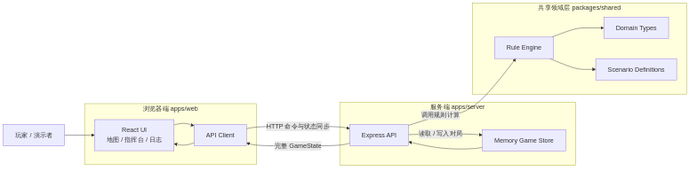
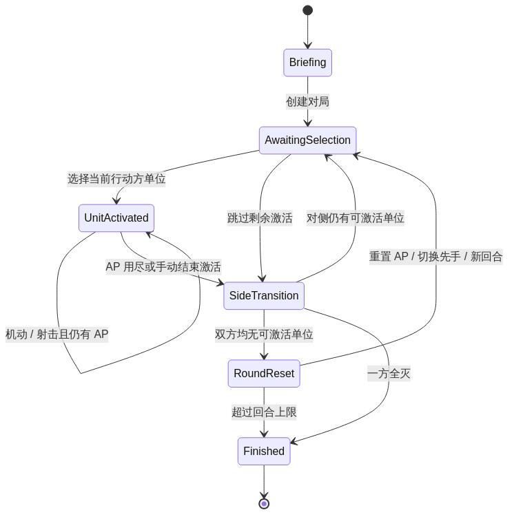

# 总体设计说明

## 1. 设计目标

- 保持规则层与表现层解耦
- 用最少模块完成完整主循环
- 让后续扩展不会推翻当前结构

## 2. 架构概览

系统采用三层划分：

1. `apps/web`
   负责战场可视化、操作输入、状态展示。
2. `apps/server`
   负责 HTTP API、对局生命周期、命令分发。
3. `packages/shared`
   负责数据模型、示例场景、规则引擎与通用校验。

## 3. 模块拆分

### 3.1 Web 前端

- `App.tsx`
  负责页面布局、数据加载、交互分发
- `api.ts`
  负责前端与后端 API 通信
- `styles.css`
  负责战场沙盘、指挥台和信息面板风格

### 3.2 Server 后端

- `app.ts`
  注册路由、中间件与输入校验
- `store.ts`
  提供内存版对局存储
- `index.ts`
  启动服务

### 3.3 Shared 规则层

- `types.ts`
  统一定义地图、单位、命令、状态结构
- `scenario.ts`
  提供场景定义与样例部署
- `engine.ts`
  提供创建对局、执行命令、判定结果等纯函数逻辑

## 4. 关键数据模型

### 4.1 GameState

`GameState` 是系统核心对象，包含：

- 对局元信息
- 当前回合与行动方
- 地图信息
- 全部单位状态
- 战斗日志
- 胜利进度

### 4.2 UnitState

单位对象包含：

- 所属阵营
- 单位类别
- 当前位置
- 行动力
- 射程 / 火力 / 防御
- 压制与消灭状态

### 4.3 GameCommand

当前版本支持以下命令：

- `select-unit`
- `move-unit`
- `fire-at-target`
- `end-unit-activation`
- `end-round`
- `reset-game`

## 5. 规则引擎设计

### 5.1 规则实现原则

- 先保证逻辑闭环，再逐步补复杂细节
- 所有状态变更都通过命令进入引擎
- 引擎返回完整新状态，避免前端拼装状态

### 5.2 当前判定逻辑

- 移动：只支持相邻格移动，并消耗地块行动点
- 射击：基于射程、地形掩护、单位属性与随机掷骰
- 视线：使用简化路径穿越判定阻挡地块
- 回合：当双方均无可激活单位时进入下一回合
- 胜利：目标区控制与伤亡共同决定胜者

### 5.3 与原桌游的差异

为适配课程原型，当前版本做了有意识的简化：

- 只实现单位级激活，不实现完整排级命令系统
- 只支持单步移动，不实现复杂路径与机会射击
- 使用课程原型的数值公式，而不是完整战斗表
- 使用抽象示例场景，不使用商业任务原文

## 6. 状态流转

核心流转：

1. 创建对局
2. 当前行动方选择单位
3. 执行机动或射击
4. 行动点耗尽或手动结束激活
5. 切换行动方或进入下一回合
6. 达到回合上限或一方失去战斗力后结束

## 7. 存储设计

当前阶段采用内存存储：

- 优点：实现快、部署轻、适合课堂演示
- 缺点：服务重启后状态丢失，无法支撑真正联机

后续可替换为：

- Redis：房间态与短期状态同步
- PostgreSQL：对局存档、战报、用户与场景数据

## 8. 可扩展点

- 新增 WebSocket 实时同步层
- 将场景配置外置为 JSON
- 将战斗表抽象为策略对象
- 增加回放事件流
- 将单位选择与行动拆为更细粒度状态机

