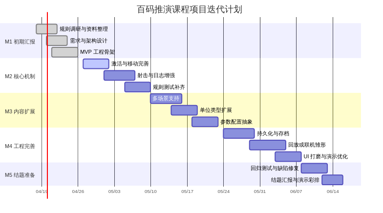

# 迭代计划

## 1. 里程碑划分

| 阶段 | 目标 | 主要产物 |
| --- | --- | --- |
| M1 | 初期汇报 | 需求、架构、骨架工程、单场景原型 |
| M2 | 核心机制迭代 | 更多规则、命令校验、更多日志与 UI 提示 |
| M3 | 内容扩展 | 多场景、更多单位类型、参数配置 |
| M4 | 工程完善 | 持久化、回放、联机设计或半成品 |
| M5 | 结题答辩 | 测试、演示稿、总结报告 |

## 2. 当前已完成

- 公开规则资料收集与整理
- 项目目标与边界定义
- 统一目录结构
- 共享规则引擎骨架
- Web 原型页面
- 初始 API
- 文档首版

## 3. 下一步任务建议

### 迭代一：打磨 MVP 主循环

- 完善射击反馈文案
- 增加更多单位信息提示
- 为每种地形加入更明确的说明
- 补充 API 回归测试

### 迭代二：增强规则表达力

- 机会射击
- 领导加成
- 更合理的回合先手逻辑
- 目标区更多胜利条件

### 迭代三：增强展示与答辩效果

- 新增战报面板
- 新增对局回放雏形
- 新增场景切换展示
- 完善演示脚本

## 4. 排期图

## 5. 里程碑验收标准

### M1 验收

- 代码可运行
- 文档可汇报
- 原型能完成一轮机动与射击演示

### M2 验收

- 规则覆盖更完整
- 前后端交互更稳定
- 自动化测试数量明显增加

### M3 验收

- 至少支持两个场景或更多规则配置
- 演示内容更丰富

