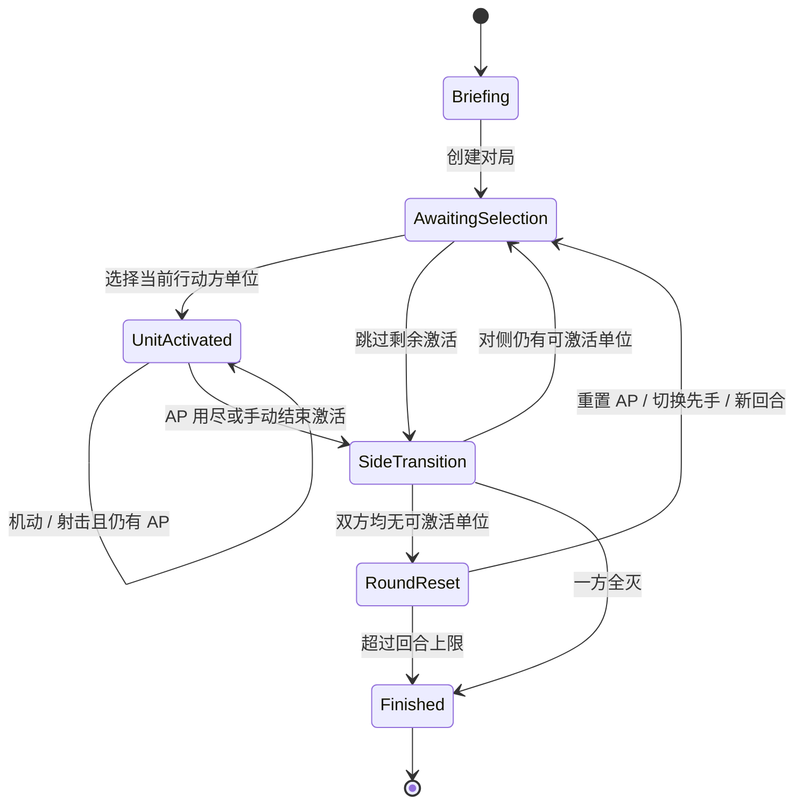

# 对局状态机

百码推演原型从创建对局到回合推进再到结算的状态流转图。

```mermaid
stateDiagram-v2
    [*] --> Briefing
    Briefing --> AwaitingSelection: 创建对局

    AwaitingSelection --> UnitActivated: 选择当前行动方单位
    UnitActivated --> UnitActivated: 机动 / 射击且仍有 AP
    UnitActivated --> SideTransition: AP 用尽或手动结束激活
    AwaitingSelection --> SideTransition: 跳过剩余激活

    SideTransition --> AwaitingSelection: 对侧仍有可激活单位
    SideTransition --> RoundReset: 双方均无可激活单位
    SideTransition --> Finished: 一方全灭

    RoundReset --> AwaitingSelection: 重置 AP / 切换先手 / 新回合
    RoundReset --> Finished: 超过回合上限

    Finished --> [*]
```

