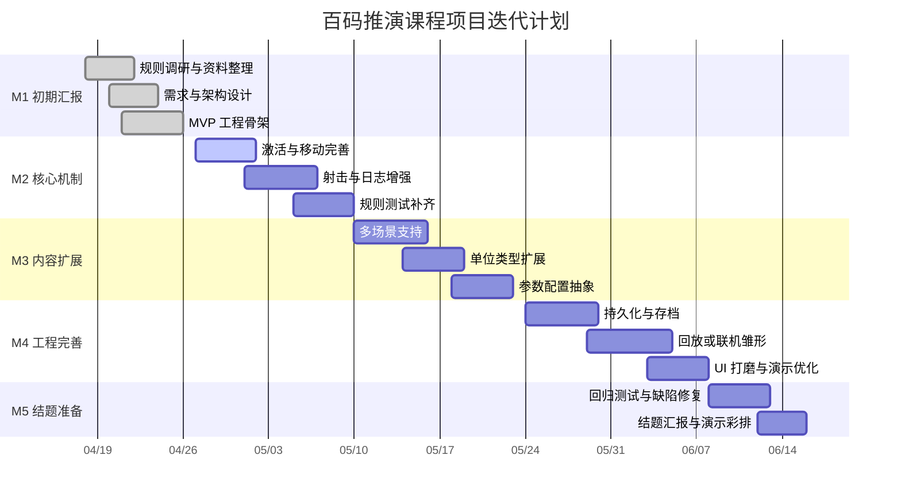

# 项目排期图

百码推演课程项目从初期汇报到结题答辩的阶段性计划图。

```mermaid
gantt
    title 百码推演课程项目迭代计划
    dateFormat  YYYY-MM-DD
    axisFormat  %m/%d

    section M1 初期汇报
    规则调研与资料整理           :done, m1a, 2026-04-18, 4d
    需求与架构设计               :done, m1b, 2026-04-20, 4d
    MVP 工程骨架                 :done, m1c, 2026-04-21, 5d

    section M2 核心机制
    激活与移动完善               :active, m2a, 2026-04-27, 5d
    射击与日志增强               :m2b, 2026-05-01, 6d
    规则测试补齐                 :m2c, 2026-05-05, 5d

    section M3 内容扩展
    多场景支持                   :m3a, 2026-05-10, 6d
    单位类型扩展                 :m3b, 2026-05-14, 5d
    参数配置抽象                 :m3c, 2026-05-18, 5d

    section M4 工程完善
    持久化与存档                 :m4a, 2026-05-24, 6d
    回放或联机雏形               :m4b, 2026-05-29, 7d
    UI 打磨与演示优化            :m4c, 2026-06-03, 5d

    section M5 结题准备
    回归测试与缺陷修复           :m5a, 2026-06-08, 5d
    结题汇报与演示彩排           :m5b, 2026-06-12, 4d
```

