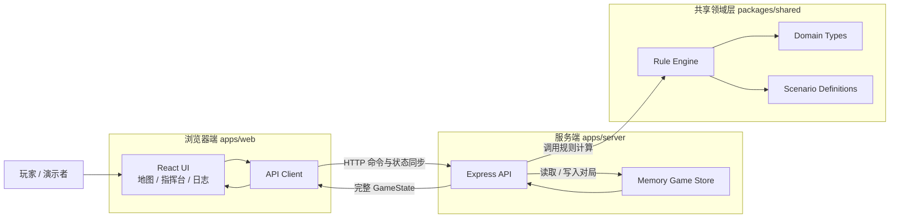

# 系统架构图

百码推演原型的前后端与共享规则引擎关系图。

```mermaid
flowchart LR
    User[玩家 / 演示者] --> UI

    subgraph Browser[浏览器端 apps/web]
        UI[React UI<br/>地图 / 指挥台 / 日志]
        Client[API Client]
    end

    subgraph Server[服务端 apps/server]
        Router[Express API]
        Store[Memory Game Store]
    end

    subgraph Domain[共享领域层 packages/shared]
        Types[Domain Types]
        Engine[Rule Engine]
        Scenario[Scenario Definitions]
    end

    UI --> Client
    Client -->|HTTP 命令与状态同步| Router
    Router -->|读取 / 写入对局| Store
    Router -->|调用规则计算| Engine
    Engine --> Types
    Engine --> Scenario
    Store --> Router
    Router -->|完整 GameState| Client
    Client --> UI
```

